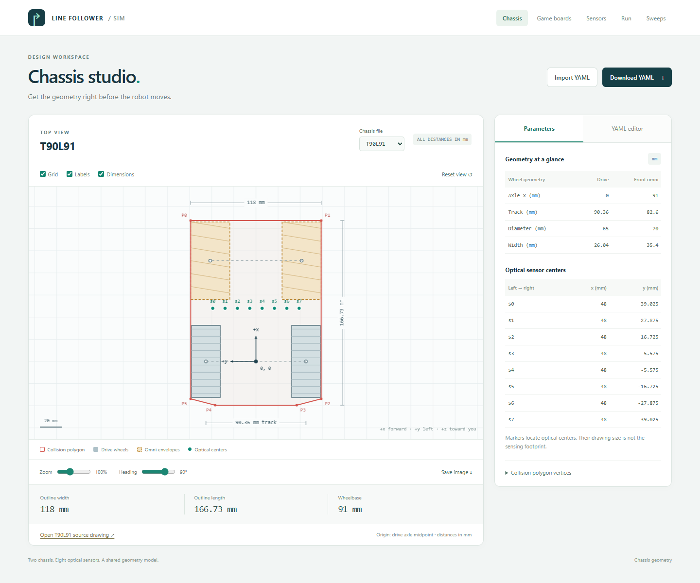
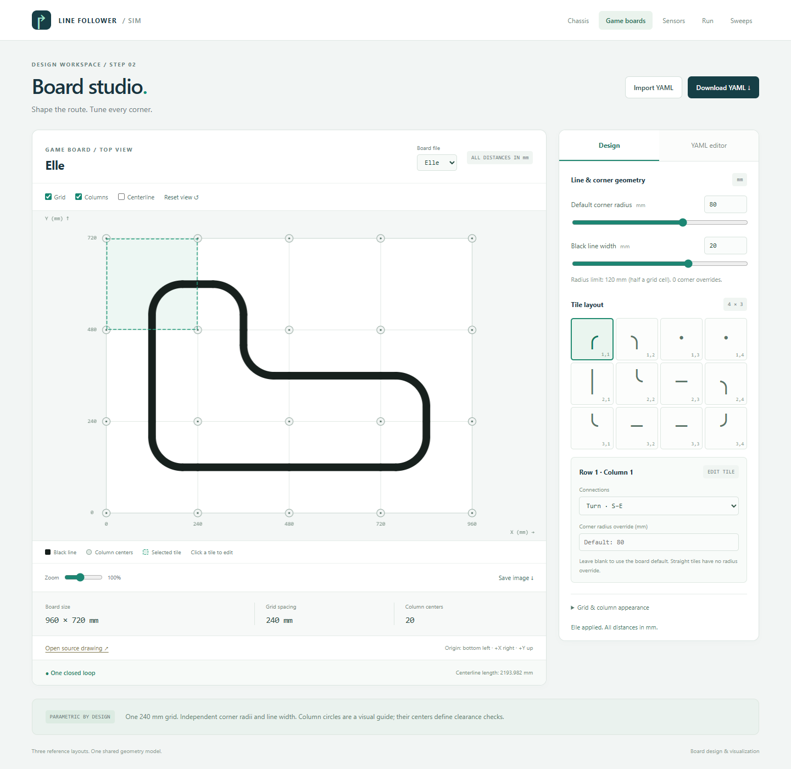
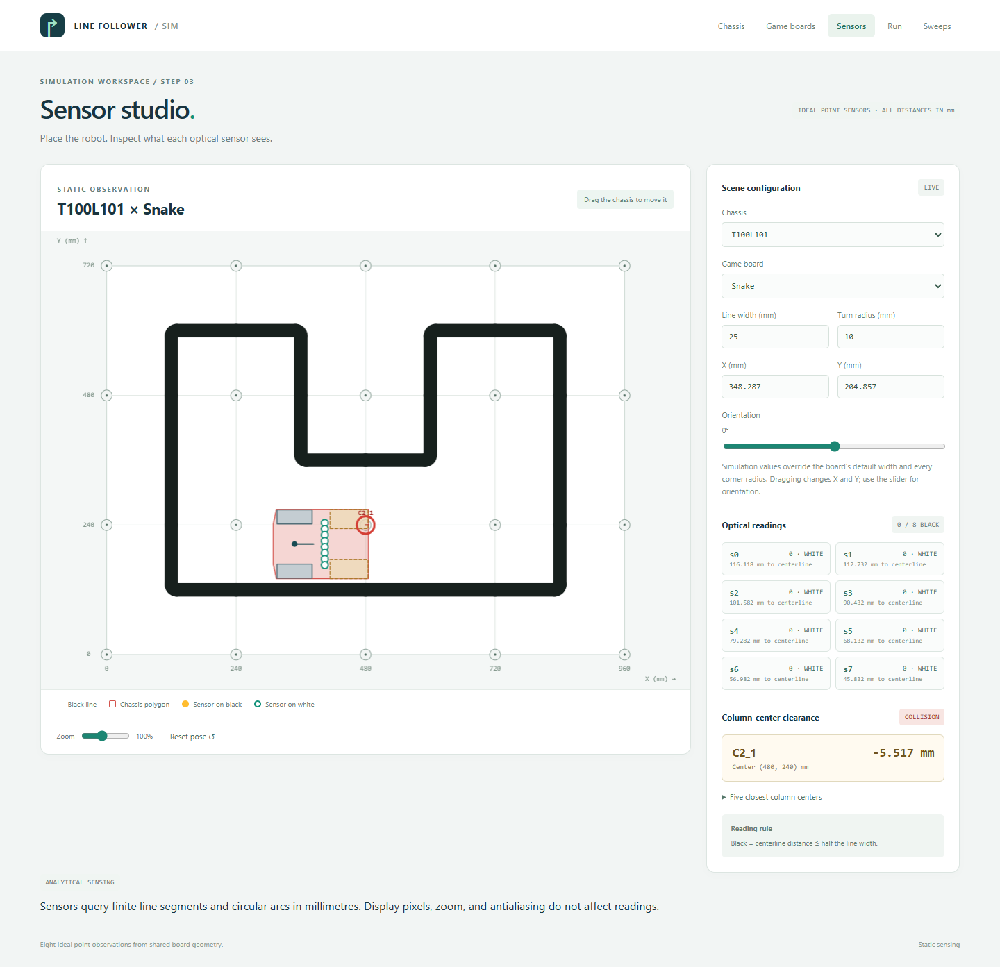
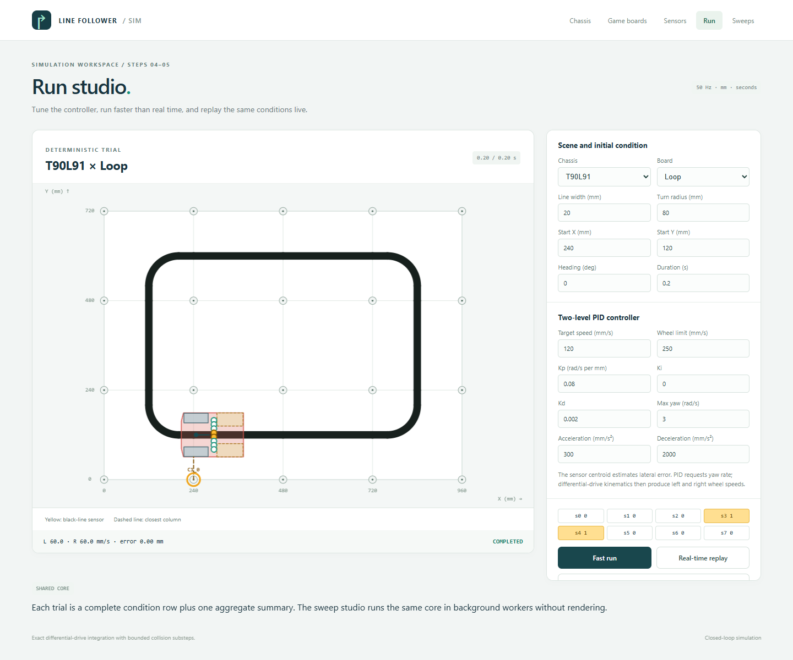
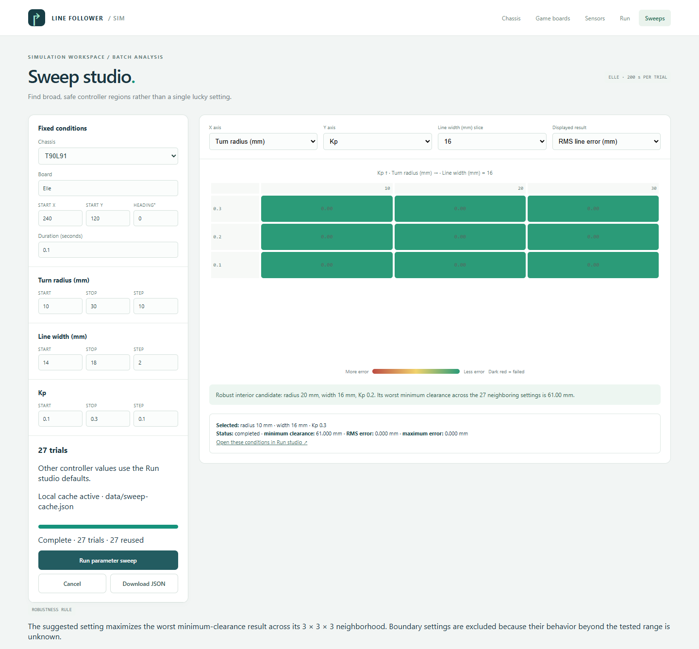

# Line-following robot simulator

A browser-based 2D simulator for designing a line-following game board, comparing
two differential-drive chassis, tuning a PID controller, and finding robust parameter
regions before testing hardware.

The simulator uses millimetres throughout and runs its controller at a fixed 50 Hz.
Board rendering, optical sensing, vehicle motion, collision clearance, individual
runs, and batch sweeps all use the same analytical geometry.

## Quick start

### Windows

Double-click [start-visualizer.cmd](start-visualizer.cmd). The launcher installs
dependencies when needed, starts the local development server, and opens the app.
Keep its terminal window open. Press `Ctrl+C` there to stop the server.

### Any supported platform

Install Node.js 24 LTS, then run:

```sh
npm ci
npm run dev
```

Open the local URL printed by Vite. In Windows PowerShell, use `npm.cmd` when the
execution policy blocks the `npm` PowerShell wrapper.

The header links the five permanent workspaces:

| Page | Purpose |
| --- | --- |
| `chassis.html` | Inspect and edit chassis geometry. |
| `board.html` | Build and visualize tile-based game boards. |
| `observe.html` | Place a chassis and inspect sensors and column clearance. |
| `simulate.html` | Run or replay one closed-loop controller trial. |
| `sweep.html` | Batch parameters and inspect numerical heat maps. |

## Chassis studio



Select either bundled chassis:

- [T90L91.yaml](configs/chassis/T90L91.yaml)
- [T100L101.yaml](configs/chassis/T100L101.yaml)

The chassis origin is the midpoint of the drive axle. Local `+x` points forward and
local `+y` points left. The page draws wheel envelopes, eight optical sensor centres,
axle dimensions, and the explicit red collision polygon. The collision polygon
preserves concavity and does not automatically include the camera or visual wheels.

Use the YAML editor or import button to test geometry changes. **Download YAML**
saves the validated configuration through the browser; it does not overwrite the
repository file automatically. The visualizer can also export a PNG.

## Board studio



The bundled Loop, Elle, and Snake boards use a 240 mm structural grid. A tile can be
empty, straight, or one of four 90° turns. Click a tile to change its connection or
give that corner its own radius. Line width and default corner radius remain separate
parameters.

Columns are visualized as 20 mm circles, but simulation collision checks use their
centre points only. Reported clearance is the signed distance from a column centre
to the actual chassis collision polygon.

Board YAML files are under [configs/boards](configs/boards). See
[BOARD_FORMAT.md](docs/BOARD_FORMAT.md) for tile tokens, coordinate conventions,
validation, imports, and exports.

## Sensor studio



Choose a chassis and board, override line width and turn radius, and enter world
`X`, `Y`, and heading. You can also drag the chassis directly on the board.

- Yellow sensor: black line detected (`1`).
- White sensor: white board detected (`0`).
- Positive clearance: the column centre is outside the chassis polygon.
- Zero clearance: boundary contact.
- Negative clearance: the column centre is inside the polygon.

Sensing queries finite line segments and circular arcs directly. Canvas pixels,
antialiasing, and zoom never affect a reading. Sensor noise is currently disabled.

## Run studio



The controller has two levels:

1. Active sensors estimate lateral line error.
2. PID converts error into yaw rate, then differential-drive kinematics produce
   left and right wheel speeds.

Configure the chassis, board, initial pose, line width, turn radius, target speed,
acceleration/deceleration ramps, PID gains, yaw limit, wheel limit, and duration.

**Fast run** advances simulated time as quickly as possible. **Real-time replay**
reruns the same resolved conditions at wall-clock speed for visual inspection. Both
modes use the same deterministic fixed-step core.

Only aggregate results are retained:

- Completion, collision, or line-loss status.
- Minimum column clearance and the responsible column/time.
- RMS and maximum absolute line error.
- Distance travelled and line-loss durations.
- Final pose and completed control steps.

Use **Download conditions + summary** to save a reproducible JSON record. Per-step
poses, readings, and commands are deliberately omitted.

## Sweep studio



The default experiment uses the asymmetric Elle board for 200 simulated seconds and
evaluates:

- Turn radius from 10 to 120 mm in 10 mm steps.
- Line width from 14 to 26 mm in 2 mm steps.
- `Kp` from 0.1 to 0.8 in 0.1 steps.

This produces 672 conditions and runs them across up to four Web Workers. You can
edit every range. Choose any two parameters as heat-map axes and use the third as a
selectable slice.

Available heat-map values are minimum clearance, RMS line error, and maximum line
error. Green always means better: larger clearance or smaller error. Failed trials
are dark red. Click a cell to inspect its summary or open those conditions in the
Run studio.

The robust candidate maximizes the worst minimum clearance across its full
3 × 3 × 3 neighbourhood. Boundary points are excluded because the sweep does not
show what happens immediately beyond the tested range.

### Refining a promising region

A useful workflow is:

1. Run a coarse sweep over the plausible range.
2. View minimum clearance first and locate a broad high-clearance region.
3. Narrow the bounds around that region and halve one or more step sizes.
4. Explore sideways by changing axes and slices.
5. Check RMS and maximum line error before selecting a final configuration.
6. Open representative cells in the Run studio and watch real-time replays.

Overlapping refinements do not recompute conditions already present in the local
cache.

## Persistent local sweep cache

When running through `start-visualizer.cmd` or `npm run dev`, summaries are written
automatically to [data/sweep-cache.json](data/sweep-cache.json). Before a sweep, the
page looks up every requested condition, displays cache hits immediately, and sends
only missing conditions to workers. Partial overlap is supported, and completed
results are saved in small batches even if you later cancel the sweep.

The SHA-256 cache key covers:

- Simulation engine version.
- Complete chassis and board configuration snapshots.
- Initial pose and duration.
- Controller and numerical settings.
- Line width, turn radius, and `Kp`.

Changing any of these creates a distinct cache entry. Numerical engine changes bump
`SIMULATION_ENGINE_VERSION`, preventing old summaries from being silently reused.

The cache is a normal repository file. After local experiments, `git status` shows
it as modified; commit it only when the cached results should be shared. The file
stores aggregate summaries, never trajectories.

Static hosting such as GitHub Pages cannot write to the repository. The sweep page
detects this, reports **Static mode**, keeps results in memory, and still offers JSON
download. `npm run preview` behaves like this static deployment; use `npm run dev`
when repository-backed caching is wanted.

## Coordinate conventions

- Distance and geometry: millimetres.
- Linear wheel speed: millimetres per second.
- Internal angles: radians; UI headings: degrees.
- World `+X`: right; world `+Y`: up.
- Heading zero: chassis forward aligned with world `+X`.
- Positive heading and yaw: counterclockwise.
- Positive sensor error: line lies to the chassis left.
- Controller period: 0.02 seconds.

Board defaults such as `default_width_mm` are design-time values. Run and sweep
settings override them without modifying the source YAML.

## Validation and production build

Run all checks with:

```sh
npm test
npm run build
npm run test:browser
```

The browser test uses installed Google Chrome in headless mode. Set
`BROWSER_CHANNEL=msedge` to use Microsoft Edge. Test screenshots and temporary cache
data are written under the ignored `outputs/` directory.

Build static files with `npm run build`; the result is in `dist/`. Preview it with:

```sh
npm run preview
```

Relative asset paths allow `dist/` to be hosted beneath a GitHub Pages repository
path. The static build does not include the local cache write API.

## Repository layout

```text
configs/chassis/       Chassis YAML files
configs/boards/        Board YAML files
data/                  Persistent local sweep-summary cache
docs/                  Design notes, schemas, and README images
references/            Original chassis and board drawings
src/core/              Browser-independent geometry and simulation core
src/web/               Canvas pages, controls, workers, and rendering
tests/                 Core and browser integration tests
vite-sweep-cache.ts    Local development cache API
```

## Design documents

- [Development plan](docs/DEVELOPMENT_PLAN.md)
- [Technology choice](docs/TECHNOLOGY.md)
- [Chassis inputs](docs/CHASSIS_INPUTS.md)
- [Board YAML format](docs/BOARD_FORMAT.md)
- [Sensor architecture](docs/SENSING_ARCHITECTURE.md)
- [Simulation conditions and summaries](docs/SIMULATION_RUNS.md)
- [Controller, sweeps, robustness, and caching](docs/CONTROL_AND_SWEEPS.md)
